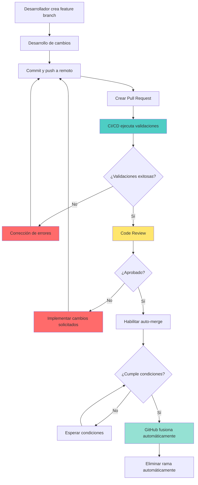
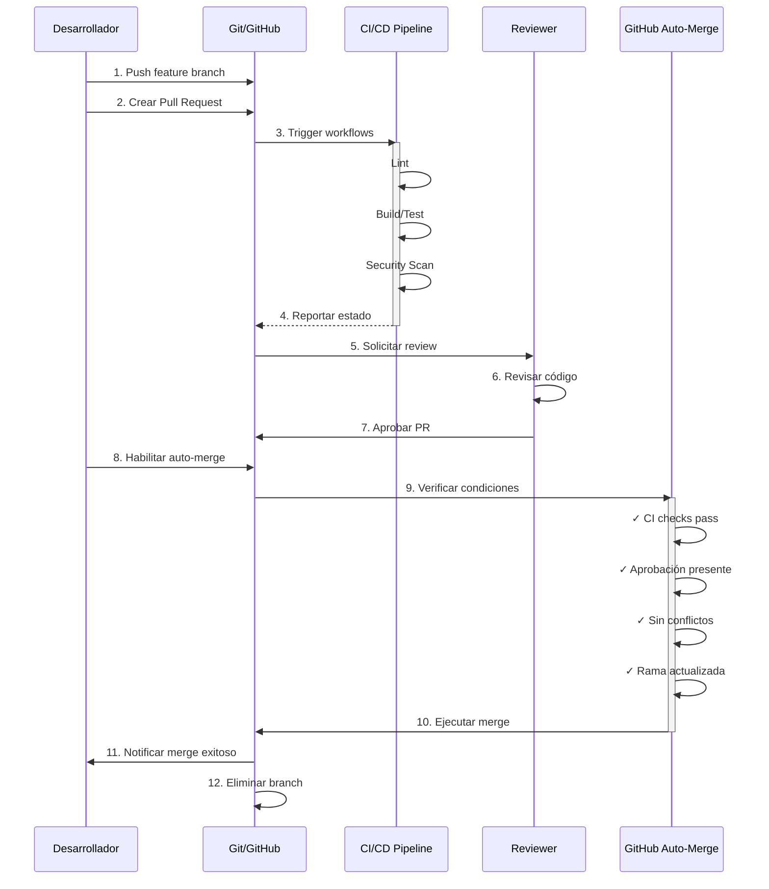
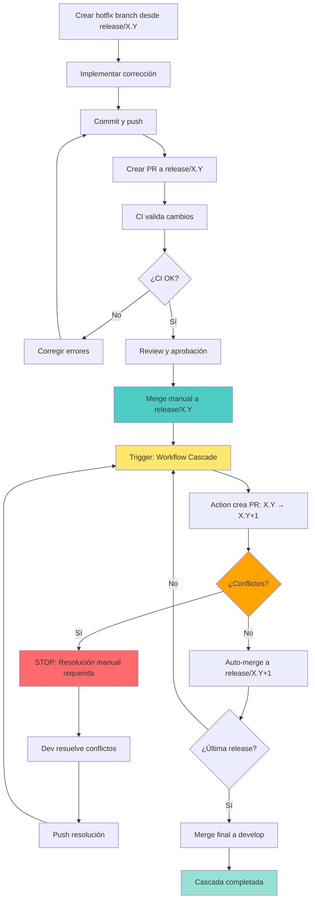

# Estrategias de Auto-Merge en GitHub

## Introducción

## ¿Qué es auto-merge?

Es la capacidad de GitHub para fusionar automáticamente Pull Requests (PRs) cuando se cumplen ciertas condiciones predefinidas, como la aprobación de revisores, el paso de checks de CI/CD, y la ausencia de conflictos. Esta funcionalidad permite acelerar el proceso de integración de código, reducir la fricción en el desarrollo diario, y mantener un flujo de trabajo ágil.

Entre otras muchas estrategias, aquí se detallan dos enfoques específicos de auto-merge:

**Estrategia 1: Auto-Merge de Features**  
Fusión automática de ramas de características utilizando la funcionalidad nativa de GitHub combinada con validaciones de CI/CD.

**Estrategia 2: Auto-Merge de Hotfixes con Cascada**  
Propagación automática de correcciones críticas a través de múltiples ramas de release siguiendo el patrón de cascada.

---

## 1. Auto-Merge de Features

### 1.1 Descripción

Sistema de integración continua que permite la fusión automática de Pull Requests cuando se cumplen criterios predefinidos de calidad y aprobación, eliminando la necesidad de workflows personalizados complejos.

### 1.2 Alcance y Aplicabilidad

**Casos de Uso Óptimos:**

- Equipos pequeños y medianos (2-10 desarrolladores)
- Proyectos con flujo de features independientes
- Entornos que priorizan simplicidad sobre automatización total
- Organizaciones que valoran el control manual del timing de merge

**Limitaciones:**

- Requiere habilitación manual de auto-merge por PR
- No incluye automatización de etiquetado
- Menos apropiado para equipos muy grandes con alto volumen de PRs

### 1.3 Diagrama de Flujo

Este diagramá es solo una propuesta, muchas veces es interesante paralelizar el proceso de revisión con el de validación, para acelerar el proceso. O incluso revisar la PR antes de iniciar el proceso de validación, para evitar gastar recursos en PRs que no cumplen criterios básicos de calidad. Es importante retener que este proceso es configurable y adaptable a las necesidades de cada equipo, proyecto o contexto.



### 1.4 Diagrama de Secuencia



### 1.5 Configuración del Repositorio

#### 1.5.1 Configuración General

**Ubicación:** `Settings > General > Pull Requests`

```yaml
Configuraciones requeridas:
  - Allow auto-merge: ✓ Habilitado
  - Automatically delete head branches: ✓ Habilitado (recomendado)
  - Allow squash merging: ✓ Habilitado (opcional)
```

#### 1.5.2 Permisos de GitHub Actions

**Ubicación:** `Settings > Actions > General > Workflow permissions`

```yaml
Permisos:
  - Read and write permissions: ✓ Seleccionado
```

#### 1.5.3 Protección de Ramas

**Ubicación:** `Settings > Branches > Branch protection rules`

```yaml
Branch name pattern: main

Reglas obligatorias:
  Require a pull request before merging:
    - Enabled: true
    - Required approvals: 1
    - Dismiss stale reviews: true (recomendado)
    - Require review from Code Owners: true (recomendado)

  Require status checks to pass before merging:
    - Enabled: true
    - Require branches to be up to date: true
    - Status checks requeridos:
        - lint
        - test
        - security
        - quality-gates

  Require conversation resolution: true
  Allow auto-merge: true

Reglas opcionales:
  - Require linear history: true
  - Require signed commits: true
  - Include administrators: true
```

> **Nota:** Los status checks solo aparecen después de ejecutar workflows por primera vez. Crear un PR de prueba para inicializar.

#### 1.5.4 Workflow de CI/CD

**Archivo:** `.github/workflows/ci.yml`

```yaml
name: CI Validation

on:
  pull_request:

concurrency:
  group: ${{ github.workflow }}-${{ github.ref }}
  cancel-in-progress: true

jobs:
  lint:
    name: Lint
    runs-on: ubuntu-latest
    steps:
      - uses: actions/checkout@v4
      - name: Run linter
        run: |
          # Comandos de lint específicos del proyecto

  test:
    name: Build & Test
    runs-on: ubuntu-latest
    steps:
      - uses: actions/checkout@v4
      - name: Run tests
        run: |
          # Comandos de build/test específicos del proyecto

  security:
    name: Security Scan
    runs-on: ubuntu-latest
    steps:
      - uses: actions/checkout@v4
      - name: Security audit
        run: |
          # Comandos de auditoría de seguridad

  quality-gates:
    name: Quality Gates
    needs: [lint, test, security]
    runs-on: ubuntu-latest
    steps:
      - name: All checks passed
        run: echo "✓ All quality gates passed"
```

### 1.6 Flujo de Trabajo Operativo

```bash
# 1. Crear branch de feature
git checkout -b feature/nueva-funcionalidad

# 2. Desarrollar y commit
git add .
git commit -m "feat: agregar nueva funcionalidad"

# 3. Push y crear PR
git push -u origin feature/nueva-funcionalidad
gh pr create --title "feat: nueva funcionalidad" --body "Descripción"

# 4. Esperar validaciones CI (automático)

# 5. Solicitar review
gh pr review --request @reviewer

# 6. Tras aprobación, habilitar auto-merge
gh pr merge --auto --squash <PR_NUMBER>

# 7. GitHub fusiona automáticamente cuando se cumplen condiciones
```

### 1.7 Condiciones de Merge Automático

El PR se fusionará **únicamente** cuando:

- ✅ Todos los status checks configurados pasen exitosamente
- ✅ Tenga el número de aprobaciones requerido
- ✅ La rama esté actualizada con la base
- ✅ No existan conflictos de merge
- ✅ El PR no esté en estado draft
- ✅ Todas las conversaciones estén resueltas
- ✅ Auto-merge haya sido habilitado explícitamente

---

## 2. Auto-Merge de Hotfixes con Cascada

### 2.1 Descripción

Sistema automatizado de propagación de correcciones críticas a través de múltiples ramas de release, siguiendo el patrón Gitflow. Garantiza que los hotfixes se apliquen de forma secuencial y controlada a todas las versiones afectadas.

### 2.2 Alcance y Aplicabilidad

**Casos de Uso Óptimos:**

- Aplicaciones con múltiples versiones en producción
- Correcciones de seguridad críticas (CVEs)
- Bugs críticos que afectan múltiples releases
- Equipos siguiendo Gitflow o estrategias similares

**Ventajas:**

- Previene olvido de aplicar hotfix en versiones
- Reduce tiempo de propagación de fixes críticos
- Mantiene historial de merge limpio y trazable
- Detección automática de conflictos

### 2.3 Diagrama de Flujo



### 2.4 Diagrama de Secuencia

```mermaid
sequenceDiagram
    participant Dev as Desarrollador
    participant R1 as release/1.0
    participant R2 as release/1.1
    participant R3 as release/2.0
    participant D as develop
    participant GHA as GitHub Actions
    participant CI as CI/CD

    Dev->>R1: 1. Crear hotfix/security-fix
    Dev->>R1: 2. Implementar corrección
    Dev->>R1: 3. Push y crear PR

    R1->>CI: 4. Validar con CI
    activate CI
    CI-->>R1: ✓ Validaciones OK
    deactivate CI

    Dev->>R1: 5. Merge manual PR

    R1->>GHA: 6. Event: PR merged en release/1.0
    activate GHA
    GHA->>GHA: Detectar patrón 'release/' o 'hotfix/'
    GHA->>R2: 7. Crear PR: 1.0 → 1.1

    alt Sin conflictos
        GHA->>R2: 8a. Auto-merge exitoso
        R2->>GHA: 9a. Event: PR merged en release/1.1
        GHA->>R3: 10a. Crear PR: 1.1 → 2.0
        GHA->>R3: 11a. Auto-merge exitoso
        R3->>GHA: 12a. Event: PR merged en release/2.0
        GHA->>D: 13a. Crear PR: 2.0 → develop
        GHA->>D: 14a. Auto-merge exitoso
        deactivate GHA
    else Con conflictos
        GHA->>R2: 8b. PR creado con conflictos
        GHA->>Dev: 9b. Notificar conflicto
        deactivate GHA
        Dev->>R2: 10b. Resolver manualmente
        Dev->>R2: 11b. Merge manual
        R2->>GHA: 12b. Reanudar cascada
        activate GHA
        GHA->>R3: 13b. Continuar con siguiente rama
        deactivate GHA
    end

    GHA-->>Dev: 15. Notificación: Cascada completada
```

### 2.5 Configuración del Repositorio

#### 2.5.1 Estructura de Ramas

```
main (producción)
├── release/1.0 (primera versión soportada)
├── release/1.1 (versión intermedia)
├── release/2.0 (última versión)
└── develop (desarrollo activo)
```

**Creación de estructura:**

```bash
git checkout develop
git checkout -b release/1.0 develop
git push -u origin release/1.0

git checkout develop
git checkout -b release/1.1 develop
git push -u origin release/1.1

git checkout develop
git checkout -b release/2.0 develop
git push -u origin release/2.0
```

#### 2.5.2 Configuración General

**Ubicación:** `Settings > General > Pull Requests`

```yaml
Configuraciones requeridas:
  - Automatically delete head branches: ✗ DESHABILITADO
    # La action necesita que las ramas source permanezcan
```

#### 2.5.3 Permisos de GitHub Actions

**Ubicación:** `Settings > Actions > General > Workflow permissions`

```yaml
Permisos:
  - Read and write permissions: ✓ Habilitado
  - Allow GitHub Actions to create and approve pull requests: ✓ Habilitado
```

#### 2.5.4 Personal Access Token (Opcional)

**Requerido solo si se usa Branch Protection en release branches**

1. Crear PAT con scopes: `repo`, `workflow`
2. Agregar como secret: `MERGE_TOKEN`
3. Configurar en workflow (ver siguiente sección)

#### 2.5.5 Workflow de Cascada

**Archivo:** `.github/workflows/cascade-merge.yml`

```yaml
name: Hotfix Cascading Auto-Merge

on:
  pull_request:
    types: [closed]

permissions:
  contents: write
  pull-requests: write
  issues: write

jobs:
  cascade-merge:
    name: Cascade Merge to Release Branches
    runs-on: ubuntu-latest

    # Solo ejecutar si PR fue mergeado y es release/* o hotfix/*
    if: |
      github.event.pull_request.merged == true &&
      (startsWith(github.head_ref, 'release/') || startsWith(github.head_ref, 'hotfix/'))

    steps:
      - name: Cascading Auto-Merge
        uses: ActionsDesk/cascading-downstream-merge@v3.0.0
        with:
          github_token: ${{ secrets.GITHUB_TOKEN }}
          # Si usas branch protection, descomentar:
          # merge_token: ${{ secrets.MERGE_TOKEN }}
          prefixes: release/
          ref_branch: develop
```

#### 2.5.6 Workflow de CI (Validación)

**Archivo:** `.github/workflows/ci.yml`

```yaml
name: CI Validation

on:
  pull_request:
  push:
    branches:
      - "release/**"
      - develop
      - main

jobs:
  test:
    name: Run Tests
    runs-on: ubuntu-latest
    steps:
      - uses: actions/checkout@v4
      - name: Run tests
        run: |
          # Comandos de test específicos del proyecto

  security-scan:
    name: Security Scan
    runs-on: ubuntu-latest
    steps:
      - uses: actions/checkout@v4
      - name: Security audit
        run: |
          # Comandos de auditoría de seguridad
```

### 2.6 Flujo de Trabajo Operativo

```bash
# 1. Crear hotfix desde release más antigua afectada
git checkout release/1.0
git pull origin release/1.0
git checkout -b hotfix/security-cve-2026

# 2. Implementar corrección
# ... realizar cambios en el código ...

# 3. Commit y push
git add .
git commit -m "fix: Patch SQL injection vulnerability (CVE-2026-12345)"
git push -u origin hotfix/security-cve-2026

# 4. Crear PR en GitHub: hotfix/security-cve-2026 → release/1.0

# 5. Esperar CI validation (automático)

# 6. Review y aprobación

# 7. Merge manual del PR

# 8. Cascada automática se ejecuta:
#    - release/1.0 → release/1.1 (auto PR + auto merge)
#    - release/1.1 → release/2.0 (auto PR + auto merge)
#    - release/2.0 → develop (auto PR + auto merge)
```

### 2.7 Manejo de Conflictos

**Comportamiento ante conflictos:**

1. La cascada se **detiene** en la rama con conflictos
2. Se crea un PR con estado de conflicto
3. El desarrollador recibe notificación
4. La cascada **NO continúa** a ramas posteriores

**Resolución:**

```bash
# 1. Checkout a la rama con conflicto
git checkout release/1.1
git pull origin release/1.1

# 2. Merge manual desde rama anterior
git merge release/1.0

# 3. Resolver conflictos
git status
# Editar archivos con conflictos
git add .
git commit -m "Resolve merge conflicts from release/1.0"

# 4. Push
git push origin release/1.1

# 5. La cascada se reanuda automáticamente
```

### 2.8 Ventajas y Limitaciones

**Ventajas:**

- ✅ Propagación automática a múltiples versiones
- ✅ Reduce riesgo de olvidar aplicar hotfix
- ✅ Historial de merge limpio y trazable
- ✅ Detección inmediata de conflictos
- ✅ Ahorro de tiempo en fixes críticos

**Limitaciones:**

- ⚠️ Requiere estructura de ramas predefinida
- ⚠️ Conflictos detienen la cascada
- ⚠️ No es apropiado para hotfixes con cambios significativos
- ⚠️ Necesita disciplina en nomenclatura de ramas

---

## 3. Comparación de Estrategias

| Criterio                    | Auto-Merge Features              | Auto-Merge Hotfix Cascada             |
| --------------------------- | -------------------------------- | ------------------------------------- |
| **Objetivo**                | Integración continua de features | Propagación de correcciones críticas  |
| **Patrón de desarrollo**    | Feature branching                | Gitflow multi-release                 |
| **Complejidad setup**       | Baja                             | Media                                 |
| **Workflows requeridos**    | 1 (CI)                           | 2 (CI + Cascade)                      |
| **Intervención manual**     | Habilitar auto-merge por PR      | Merge inicial + resolución conflictos |
| **Ramas objetivo**          | 1 (main/develop)                 | Múltiples (releases + develop)        |
| **Manejo de conflictos**    | Bloquea merge individual         | Detiene cascada                       |
| **Mejor para**              | Desarrollo diario de features    | Hotfixes multi-versión                |
| **Usuarios GitHub Actions** | Bajo                             | Medio                                 |

---

## 4. Consideraciones de Implementación

### 4.1 Requerimientos Previos

**Para ambas estrategias:**

- GitHub Free/Pro/Team/Enterprise
- Permisos de administrador del repositorio
- GitHub Actions habilitado

**Conocimientos técnicos:**

- Git flow básico
- YAML (configuración de workflows)
- CI/CD conceptos fundamentales

### 4.2 Métricas de Éxito

**Auto-Merge Features:**

- Tiempo promedio de merge reducido en 50-70%
- Reducción de PRs estancados
- Mayor throughput de development

**Auto-Merge Hotfix Cascada:**

- Tiempo de propagación de hotfix < 10 minutos
- 0% de olvido de aplicar hotfix en versiones
- Reducción de errores humanos en propagación

### 4.3 Riesgos y Mitigaciones

| Riesgo                          | Impacto | Mitigación                                      |
| ------------------------------- | ------- | ----------------------------------------------- |
| Auto-merge de código defectuoso | Alto    | CI robusto con múltiples validaciones           |
| Conflictos en cascada           | Medio   | Monitoreo de notificaciones + resolución rápida |
| Branch protection bypass        | Alto    | Usar PAT con permisos limitados                 |
| Sobrecarga de PRs automáticos   | Bajo    | Configurar notificaciones selectivas            |

### 4.4 Buenas Prácticas

**Generales:**

- Implementar suite de tests comprehensiva
- Configurar CODEOWNERS para reviews automáticos
- Usar conventional commits para claridad
- Mantener PRs pequeños (< 400 líneas)
- Documentar configuraciones en README

**Auto-Merge Features:**

- Habilitar auto-merge solo cuando PR esté 100% listo
- Validar localmente antes de push
- Responder a comentarios antes de merge

**Auto-Merge Hotfix Cascada:**

- Usar versionado semántico estricto (X.Y)
- Documentar cada hotfix con tag git
- Crear hotfix desde la versión más antigua afectada
- Notificar al equipo de hotfixes críticos
- Mantener CHANGELOG.md actualizado

---

## 5. Recursos Adicionales

### 5.1 Documentación Oficial

- [GitHub Auto-merge](https://docs.github.com/en/pull-requests/collaborating-with-pull-requests/incorporating-changes-from-a-pull-request/automatically-merging-a-pull-request)
- [Branch Protection Rules](https://docs.github.com/en/repositories/configuring-branches-and-merges-in-your-repository/managing-protected-branches)
- [GitHub Actions](https://docs.github.com/en/actions)
- [Gitflow Workflow](https://www.atlassian.com/git/tutorials/comparing-workflows/gitflow-workflow)

### 5.2 Herramientas

- GitHub CLI (`gh`): Gestión de PRs desde terminal
- GitHub Actions: `ActionsDesk/cascading-downstream-merge`
- Conventional Commits: Estándar de commits

### 5.3 Comandos Útiles

```bash
# Ver estado de PRs
gh pr list
gh pr view <NUMBER>
gh pr checks <NUMBER>

# Gestionar auto-merge
gh pr merge --auto --squash <NUMBER>
gh pr merge --disable-auto <NUMBER>

# Workflows
gh run list
gh run view <RUN_ID>

# Verificar configuración
gh api /repos/{owner}/{repo}/branches/main/protection
```

---

## 6. Conclusiones

Ambas estrategias de auto-merge representan soluciones maduras para automatizar procesos de integración de código, cada una optimizada para escenarios específicos:

**Auto-Merge de Features** ofrece simplicidad y eficiencia para equipos que buscan reducir fricción en el desarrollo diario, manteniendo control sobre el timing de integración.

**Auto-Merge de Hotfix Cascada** proporciona robustez y seguridad para equipos que mantienen múltiples versiones en producción y requieren garantías de propagación consistente de correcciones críticas.

La combinación de ambas estrategias en un mismo repositorio es no solo posible, sino recomendable para equipos que operan bajo Gitflow o patrones similares, obteniendo lo mejor de ambos mundos: agilidad en features y control en hotfixes.

---

**Versión del documento:** 1.0  
**Fecha:** Febrero 2026  
**Licencia:** MIT
