# Automerge de Dependabot

## 📋 Descripción

Esta estrategia automatiza la integración de pull requests generados por Dependabot para mantener las dependencias del proyecto actualizadas sin intervención manual.

## 🎯 Casos de Uso

- Proyectos con muchas dependencias que requieren actualizaciones frecuentes
- Equipos que necesitan mantenerse al día con parches de seguridad
- Automatización de updates menores y de parches
- Mantenimiento continuo de dependencias de GitHub Actions

## 🔄 Flujo de Trabajo

```mermaid
graph LR
    A[Dependabot crea PR] --> B{Checks pasan?}
    B -->|Sí| C[Auto-aprobación]
    C --> D[Auto-merge]
    B -->|No| E[Requiere revisión manual]
```



## ⚙️ Configuración

### 1. Habilitar Dependabot

**Settings > Security > Code security and analysis**:

1. **Dependabot alerts**: Click **Enable**
2. **Dependabot security updates**: Click **Enable**
3. **Dependabot version updates**: Click **Enable**

### 2. Crear Configuración de Dependabot

Crea `.github/dependabot.yml`:

```yaml
---
version: 2

updates:
  # Dependencias de Node.js/npm
  - package-ecosystem: "npm"
    directory: "/"
    schedule:
      interval: "weekly"
      day: "monday"
      time: "09:00"
      timezone: "Europe/Madrid"
    
    open-pull-requests-limit: 10
    pull-request-branch-name:
      separator: "-"
    
    commit-message:
      prefix: "build(deps)"
      prefix-development: "build(deps-dev)"
      include: "scope"
    
    labels:
      - "dependencies"
      - "automerge"
    
    groups:
      development-dependencies:
        dependency-type: "development"
        update-types:
          - "minor"
          - "patch"
      
      production-dependencies:
        dependency-type: "production"
        update-types:
          - "patch"
    
    reviewers:
      - "tu-usuario"
    
    ignore:
      - dependency-name: "webpack"
        update-types: ["version-update:semver-major"]

  # Dependencias de GitHub Actions
  - package-ecosystem: "github-actions"
    directory: "/"
    schedule:
      interval: "weekly"
    labels:
      - "github-actions"
      - "automerge"
```

### 3. Workflow de GitHub Actions

Crea `.github/workflows/dependabot-automerge.yml`:

```yaml
---
name: 🤖 Dependabot Auto-Merge

on:
  pull_request:
    types: [opened, reopened, synchronize, ready_for_review]

permissions:
  contents: write
  pull-requests: write
  issues: write

jobs:
  analyze-pr:
    name: 📊 Analyze Dependabot PR
    runs-on: ubuntu-latest
    if: github.actor == 'dependabot[bot]'
    
    outputs:
      update-type: ${{ steps.metadata.outputs.update-type }}
      auto-merge-eligible: ${{ steps.check-eligibility.outputs.eligible }}
    
    steps:
      - name: 📝 Fetch Dependabot metadata
        id: metadata
        uses: dependabot/fetch-metadata@v2
        with:
          github-token: ${{ secrets.GITHUB_TOKEN }}

      - name: 📋 Display PR information
        run: |
          echo "Package: ${{ steps.metadata.outputs.dependency-names }}"
          echo "Update type: ${{ steps.metadata.outputs.update-type }}"
          echo "Previous: ${{ steps.metadata.outputs.previous-version }}"
          echo "New: ${{ steps.metadata.outputs.new-version }}"

      - name: 🔍 Check auto-merge eligibility
        id: check-eligibility
        run: |
          UPDATE_TYPE="${{ steps.metadata.outputs.update-type }}"
          if [[ "$UPDATE_TYPE" == "version-update:semver-patch" ]] || \
             [[ "$UPDATE_TYPE" == "version-update:semver-minor" ]]; then
            echo "eligible=true" >> $GITHUB_OUTPUT
          else
            echo "eligible=false" >> $GITHUB_OUTPUT
          fi
  
  security-scan:
    name: 🔒 Security Scan
    needs: analyze-pr
    runs-on: ubuntu-latest
    if: github.actor == 'dependabot[bot]'
    
    steps:
      - uses: actions/checkout@v4
        with:
          ref: ${{ github.head_ref }}

      - name: 🔧 Setup Node.js
        uses: actions/setup-node@v4
        with:
          node-version: '20'
          cache: 'npm'

      - name: 📦 Install dependencies
        run: npm audit --audit-level=high
  
  automerge:
    name: 🤖 Auto-Merge
    needs: [analyze-pr, security-scan]
    runs-on: ubuntu-latest
    if: needs.analyze-pr.outputs.auto-merge-eligible == 'true'
    
    steps:
      - name: ✅ Auto-approve
        run: gh pr review --approve "$PR_URL"
        env:
          PR_URL: ${{ github.event.pull_request.html_url }}
          GITHUB_TOKEN: ${{ secrets.GITHUB_TOKEN }}
      
      - name: 🔀 Enable auto-merge
        run: gh pr merge --auto --squash "$PR_URL"
        env:
          PR_URL: ${{ github.event.pull_request.html_url }}
          GITHUB_TOKEN: ${{ secrets.GITHUB_TOKEN }}
```

### 4. Configurar Protección de Ramas

En **Settings → Branches → Branch protection rules**:

- ✅ Require status checks to pass before merging
- ✅ Require branches to be up to date before merging
- ✅ Include administrators
- Selecciona los checks requeridos (tests, linting, security-scan)

## 🔐 Seguridad

### Restricciones Recomendadas

Solo automerge para:
- **Patch updates** (`1.0.0` → `1.0.1`)
- **Minor updates** (`1.0.0` → `1.1.0`) - Opcional

**Nunca automerge**:
- **Major updates** (`1.0.0` → `2.0.0`)
- Dependencias críticas de seguridad sin revisión

### Configuración Granular

Para mayor control, modifica el workflow:

```yaml
- name: Enable auto-merge (only patches)
  if: |
    steps.metadata.outputs.update-type == 'version-update:semver-patch' &&
    !contains(steps.metadata.outputs.dependency-names, 'critical-package')
  run: gh pr merge --auto --squash "$PR_URL"
```

## 📊 Monitoreo

### Verificar Merges Automáticos

```bash
# Ver PRs mergeados por Dependabot
gh pr list --state merged --author "dependabot[bot]" --limit 20

# Verificar PRs pendientes
gh pr list --author "dependabot[bot]" --state open
```

### Notificaciones

Configura notificaciones en Slack/Teams:

```yaml
- name: Notify on merge
  if: success()
  uses: 8398a7/action-slack@v3
  with:
    status: ${{ job.status }}
    text: "Dependabot PR auto-merged: ${{ github.event.pull_request.title }}"
  env:
    SLACK_WEBHOOK_URL: ${{ secrets.SLACK_WEBHOOK }}
```

## 🛠️ Troubleshooting

### El PR no se fusiona automáticamente

**Causas comunes**:
- Checks fallidos
- Conflictos de merge
- Protección de rama no satisfecha
- Token sin permisos suficientes

**Solución**:
```bash
# Verificar estado de checks
gh pr checks <PR_NUMBER>

# Ver detalles del PR
gh pr view <PR_NUMBER>
```

### Demasiados PRs abiertos

Ajusta `open-pull-requests-limit` en `dependabot.yml`:

```yaml
open-pull-requests-limit: 5
```

## 📝 Buenas Prácticas

1. **Suite de Tests Completa**: Asegura cobertura de tests antes de habilitar automerge
2. **Monitoreo de Producción**: Vigila métricas post-merge
3. **Rollback Plan**: Ten un plan de reversión rápida
4. **Revisión Periódica**: Audita los merges automáticos semanalmente
5. **Dependencias Críticas**: Excluye del automerge las dependencias core

## 🔗 Recursos

- [Documentación oficial de Dependabot](https://docs.github.com/en/code-security/dependabot)
- [GitHub Actions para Dependabot](https://github.com/dependabot/fetch-metadata)
- [Implementación de ejemplo](../AutoMergeDependabot/)

## ⚡ Implementación Rápida

Para implementar esta estrategia en tu repositorio:

```bash
# Copiar configuración desde el submódulo
cp AutoMergeDependabot/.github/workflows/* .github/workflows/
cp AutoMergeDependabot/.github/dependabot.yml .github/

# Commit y push
git add .github/
git commit -m "Add Dependabot automerge strategy"
git push
```

---

**Nota**: Esta estrategia funciona mejor en proyectos con una suite de tests automatizados robusta y políticas claras de versionado semántico.
