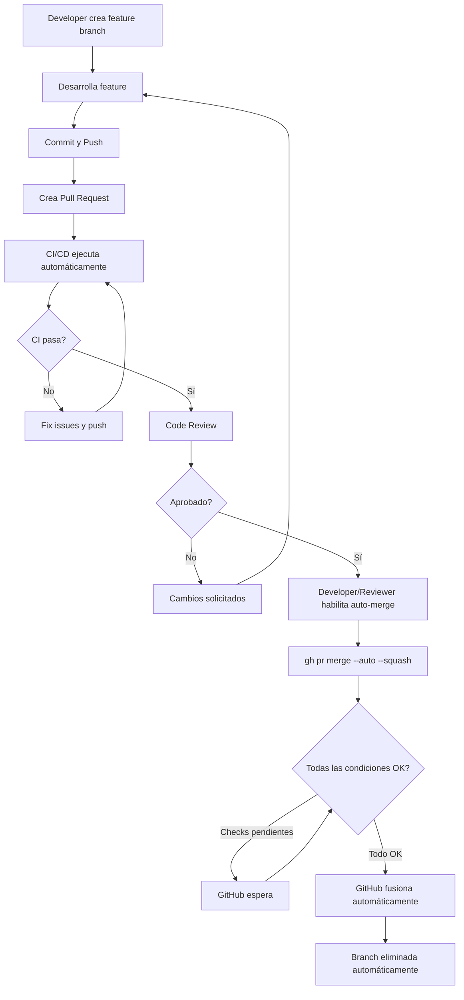

# Auto-Merge de Features Simplificado

## 📋 Descripción

Estrategia de integración automática de features usando la **funcionalidad nativa de auto-merge de GitHub** combinada con validaciones de CI/CD. Permite que GitHub fusione automáticamente los Pull Requests cuando se cumplen todas las condiciones definidas en las reglas de protección de rama.

### Diferencia Clave

A diferencia de la versión "Managed", esta estrategia **NO requiere workflows adicionales para gestionar el merge**. Utiliza la funcionalidad built-in de GitHub, activada manualmente con:

```bash
gh pr merge --auto --squash <PR_NUMBER>
```

GitHub se encarga del resto automáticamente.

## 🎯 Casos de Uso

- **Equipos pequeños o medianos** que prefieren simplicidad sobre automatización total
- Proyectos donde los desarrolladores/reviewers habilitan el auto-merge manualmente
- Entornos donde se quiere **reducir la complejidad** de workflows
- Equipos que valoran el **control manual** sobre cuándo se activa el auto-merge
- Proyectos **sin necesidad de auto-labeling** u otras automatizaciones complejas

### Ventajas

✅ **Simple**: Configuración mínima, sin workflows custom  
✅ **Nativo**: Usa funcionalidad estándar de GitHub  
✅ **Eficiente**: No consume minutos de GitHub Actions para el merge  
✅ **Flexible**: Branch Protection Rules controlan las condiciones  
✅ **Transparente**: Fácil de entender y debuggear

### Desventajas

⚠️ Requiere acción manual para habilitar auto-merge en cada PR  
⚠️ No incluye auto-labeling ni otras automatizaciones  
⚠️ Menos control fino sobre condiciones de merge complejas

## 🔄 Flujo de Trabajo



## ⚙️ Configuración

### 1. Habilitar Auto-Merge en el Repositorio

**Settings > General > Pull Requests**:

- ☑ **Allow auto-merge**
- ☑ **Automatically delete head branches** (recomendado)
- ☐ **Allow squash merging** (opcional, pero recomendado)
- ☐ **Allow rebase merging** (opcional)

### 2. Configurar Permisos de Actions

**Settings > Actions > General > Workflow permissions**:

1. Selecciona: **Read and write permissions**

> **Nota**: Solo necesario para que CI pueda ejecutarse, NO para crear workflows de merge automático.

### 3. Workflow de CI/CD

Crea `.github/workflows/ci.yml`:

```yaml
---
name: 🧪 CI Tests

on:
  pull_request:
    branches: [main, develop]
  push:
    branches: [main, develop]

# Cancel in-progress runs for the same PR
concurrency:
  group: ${{ github.workflow }}-${{ github.ref }}
  cancel-in-progress: true

env:
  NODE_VERSION: "20"

jobs:
  lint:
    name: 🔍 Lint
    runs-on: ubuntu-latest

    defaults:
      run:
        working-directory: ./src/app

    steps:
      - name: 📥 Checkout code
        uses: actions/checkout@v4

      - name: 🔧 Setup Node.js
        uses: actions/setup-node@v4
        with:
          node-version: ${{ env.NODE_VERSION }}

      - name: 📦 Install dependencies
        run: npm install

      - name: 🔍 Run ESLint
        run: npm run lint

  test:
    name: 🧪 Run Tests
    runs-on: ubuntu-latest

    defaults:
      run:
        working-directory: ./src/app

    steps:
      - name: 📥 Checkout code
        uses: actions/checkout@v4

      - name: 🔧 Setup Node.js
        uses: actions/setup-node@v4
        with:
          node-version: ${{ env.NODE_VERSION }}

      - name: 📦 Install dependencies
        run: npm install

      - name: 🏗️ Build Next.js
        run: npm run build
        env:
          NEXT_TELEMETRY_DISABLED: 1

      - name: 📤 Upload build artifacts
        uses: actions/upload-artifact@v4
        with:
          name: build-${{ github.sha }}
          path: src/app/.next
          retention-days: 1

  security:
    name: 🔒 Security Scan
    runs-on: ubuntu-latest

    defaults:
      run:
        working-directory: ./src/app

    steps:
      - name: 📥 Checkout code
        uses: actions/checkout@v4

      - name: 🔧 Setup Node.js
        uses: actions/setup-node@v4
        with:
          node-version: ${{ env.NODE_VERSION }}

      - name: 📦 Install dependencies
        run: npm install

      - name: 🔒 Run security audit
        run: npm audit --audit-level=moderate
        continue-on-error: true

      - name: 🔍 Scan for secrets
        uses: trufflesecurity/trufflehog@main
        with:
          path: ./
          base: ${{ github.event.repository.default_branch }}
          head: HEAD

  quality-gates:
    name: ✅ Quality Gates
    runs-on: ubuntu-latest
    needs: [lint, test, security]

    steps:
      - name: 📊 Check results
        run: |
          echo "✅ All quality gates passed!"
          echo "- Linting: Passed"
          echo "- Tests: Passed"
          echo "- Security: Passed"
```

### 4. Protección de Ramas

Configurar en **Settings → Branches → Add branch protection rule**:

```
Branch name pattern: main (o develop)

☑ Require a pull request before merging
  ☑ Require approvals: 1
  ☐ Dismiss stale pull request approvals (opcional)
  ☑ Require review from Code Owners (recomendado)

☑ Require status checks to pass before merging
  ☑ Require branches to be up to date before merging

  Status checks required (agregar después del primer CI run):
  - ✅ quality-gates
  - 🔍 lint
  - 🧪 test
  - 🔒 security

☑ Require conversation resolution before merging
☑ Allow auto-merge
☑ Automatically delete head branches (recomendado)

☐ Require linear history (opcional)
☐ Require signed commits (opcional)
☐ Include administrators (recomendado para equipos grandes)
```

> **⚠️ Importante**: Los status checks solo aparecen en la lista **después** de ejecutar los workflows por primera vez. Crea un PR de prueba primero.

## 🚀 Uso Práctico

### Flujo Completo de Desarrollo

```bash
# 1. Crear rama de feature desde main
git checkout main
git pull origin main
git checkout -b feature/nueva-funcionalidad

# 2. Desarrollar la feature
cd src/app
# ... hacer cambios en el código ...
cd ../..

# 3. Commit siguiendo conventional commits
git add .
git commit -m "feat: agregar nueva funcionalidad de usuario"

# 4. Push a remoto
git push -u origin feature/nueva-funcionalidad

# 5. Crear PR en GitHub (vía UI o CLI)
gh pr create \
  --title "feat: agregar nueva funcionalidad de usuario" \
  --body "## Descripción

  Implementa nueva funcionalidad para gestión de usuarios.

  ## Cambios

  - Nuevo componente UserDashboard
  - API endpoint para datos de usuario
  - Tests unitarios

  ## Testing

  - ✅ Lint pasa
  - ✅ Build exitoso
  - ✅ Tests pasan"

# 6. CI ejecuta automáticamente
# Esperar ~2-3 minutos a que pasen todos los checks

# 7. Solicitar review
gh pr review --request @reviewer-username

# 8. Después de aprobación, habilitar auto-merge
gh pr merge --auto --squash <PR_NUMBER>

# 9. GitHub fusionará automáticamente cuando:
#    - Todos los CI checks pasen ✅
#    - Tenga la aprobación requerida ✅
#    - No haya conflictos ✅
#    - Rama esté actualizada ✅
```

### Comandos Útiles

```bash
# Ver todos los PRs abiertos
gh pr list

# Ver detalle de un PR específico
gh pr view <PR_NUMBER>

# Ver estado de los checks de CI
gh pr checks <PR_NUMBER>

# Habilitar auto-merge con squash (recomendado)
gh pr merge --auto --squash <PR_NUMBER>

# Habilitar auto-merge con merge commit
gh pr merge --auto --merge <PR_NUMBER>

# Habilitar auto-merge con rebase
gh pr merge --auto --rebase <PR_NUMBER>

# Deshabilitar auto-merge
gh pr merge --disable-auto <PR_NUMBER>

# Ver estado completo incluyendo auto-merge
gh pr view <PR_NUMBER> --json autoMergeRequest,statusCheckRollup,reviews

# Aprobar un PR (si eres reviewer)
gh pr review <PR_NUMBER> --approve

# Solicitar cambios
gh pr review <PR_NUMBER> --request-changes --body "Por favor ajusta X"
```

## 🔐 Validaciones y Seguridad

### Pre-merge Checks

El CI ejecuta automáticamente en cada PR:

1. **🔍 Lint**: Valida código con ESLint
2. **🧪 Tests**: Compila/build de la aplicación
3. **🔒 Security**:
   - `npm audit` para dependencias vulnerables
   - TruffleHog para detectar secretos hardcodeados
4. **✅ Quality Gates**: Job final que confirma todo OK

### Condiciones para Auto-Merge

GitHub solo fusionará el PR cuando **TODAS** estas condiciones se cumplan:

✅ **Status checks configurados pasan** (`quality-gates`, `lint`, `test`, `security`)  
✅ **PR tiene el número de aprobaciones requerido** (configurado en Branch Protection)  
✅ **Rama está actualizada** con la base (si se requiere en Branch Protection)  
✅ **No hay conflictos** de merge  
✅ **PR no es draft**  
✅ **Todas las conversaciones están resueltas** (si se requiere)  
✅ **Auto-merge fue habilitado** manualmente

### Validaciones Adicionales Recomendadas

Para proyectos de producción, considera agregar:

```yaml
# En .github/workflows/ci.yml - Agregar más jobs

code-coverage:
  name: 📊 Code Coverage
  runs-on: ubuntu-latest
  steps:
    - uses: actions/checkout@v4
    - uses: actions/setup-node@v4
      with:
        node-version: "20"
    - run: npm ci
    - run: npm test -- --coverage
    - uses: codecov/codecov-action@v3
      with:
        files: ./coverage/coverage-final.json
        fail_ci_if_error: true

dependency-review:
  name: 🔍 Dependency Review
  runs-on: ubuntu-latest
  if: github.event_name == 'pull_request'
  steps:
    - uses: actions/checkout@v4
    - uses: actions/dependency-review-action@v4

lighthouse:
  name: 🚦 Lighthouse CI
  runs-on: ubuntu-latest
  steps:
    - uses: actions/checkout@v4
    - uses: treosh/lighthouse-ci-action@v10
      with:
        urls: |
          http://localhost:3000
        uploadArtifacts: true
```

## 🛠️ Troubleshooting

### El auto-merge no se activa

**Verificaciones**:

```bash
# 1. Verificar que auto-merge está habilitado en Settings
# Settings > General > Pull Requests > "Allow auto-merge" ✅

# 2. Ver configuración actual del PR
gh pr view <PR_NUMBER> --json autoMergeRequest,statusCheckRollup,reviews

# 3. Verificar estado de los checks
gh pr checks <PR_NUMBER>
```

**Causas comunes**:

- ❌ Auto-merge no está habilitado en Settings > General
- ❌ Branch Protection Rules no configuradas correctamente
- ❌ CI checks aún corriendo o fallaron
- ❌ No tiene las aprobaciones requeridas
- ❌ Rama desactualizada (si se requiere estar up-to-date)
- ❌ Hay conflictos de merge
- ❌ Auto-merge no fue habilitado con `gh pr merge --auto`
- ❌ Conversaciones no resueltas (si está requerido)

### CI falla

**Validar localmente antes de push**:

```bash
cd src/app

# Instalar dependencias
npm install

# Ejecutar linter
npm run lint

# Build
npm run build

# Tests (si tienes)
npm test

# Security audit
npm audit

# Verificar que funciona en dev
npm run dev
```

### Auto-merge se deshabilita solo

**Causa**: GitHub deshabilita auto-merge cuando se pushean nuevos commits (por seguridad).

**Solución**: Re-habilitar después del commit:

```bash
git add .
git commit -m "fix: corregir issues del review"
git push

# Esperar que CI pase nuevamente
gh pr checks <PR_NUMBER>

# Re-habilitar auto-merge
gh pr merge --auto --squash <PR_NUMBER>
```

### Conflictos de Merge

Si hay conflictos, el auto-merge NO se ejecutará.

**Resolver manualmente**:

```bash
# Actualizar la rama de feature con main
git checkout feature/mi-feature
git fetch origin
git merge origin/main

# Resolver conflictos manualmente
# Editar archivos en conflicto...

git add .
git commit -m "fix: resolver conflictos con main"
git push

# Re-habilitar auto-merge
gh pr merge --auto --squash <PR_NUMBER>
```

### Status checks no aparecen en Branch Protection

**Solución**:

1. Crea un PR de prueba para que se ejecuten los workflows por primera vez
2. Los workflows deben ejecutarse al menos una vez
3. Después aparecerán en la lista de "Status checks" en Branch Protection
4. Selecciónalos y guarda la configuración

```bash
# Crear PR rápido de prueba
git checkout -b test/ci-setup
echo "# Test" >> README.md
git add README.md
git commit -m "test: trigger CI workflows"
git push -u origin test/ci-setup
gh pr create --title "test: CI setup" --body "Testing CI"
```

## 📝 Buenas Prácticas

### 1. Naming Conventions

```bash
# Features
feature/user-authentication
feature/payment-integration

# Bugfixes
fix/login-validation
fix/memory-leak

# Documentación
docs/api-endpoints
docs/deployment-guide

# Refactorings
refactor/database-layer
refactor/component-structure

# Performance
perf/optimize-images
perf/reduce-bundle-size
```

### 2. Conventional Commits

Usa el estándar de [Conventional Commits](https://www.conventionalcommits.org/):

```bash
# Features
git commit -m "feat: add user authentication with OAuth"
git commit -m "feat(api): implement payment webhook"

# Fixes
git commit -m "fix: resolve login timeout issue"
git commit -m "fix(ui): correct button alignment"

# Docs
git commit -m "docs: update API endpoint documentation"

# Refactoring
git commit -m "refactor: simplify database query logic"

# Performance
git commit -m "perf: optimize image loading"

# Tests
git commit -m "test: add unit tests for auth service"

# Breaking changes
git commit -m "feat!: migrate to new API version"
git commit -m "feat: redesign user schema

BREAKING CHANGE: User table schema has changed"
```

### 3. Pull Request Guidelines

**Tamaño**:

- Mantener PRs pequeños (< 400 líneas de código)
- Un PR = Una feature/fix
- Si es más grande, dividir en múltiples PRs

**Descripción**:

```markdown
## 🎯 Propósito

Breve descripción del problema que resuelve o feature que agrega.

## ✅ Cambios

- Cambio 1
- Cambio 2
- Cambio 3

## 🧪 Testing

- ✅ Lint pasa
- ✅ Build exitoso
- ✅ Tests unitarios pasan
- ✅ Probado manualmente en [ambiente]

## 📸 Screenshots (si aplica)

[Incluir capturas de pantalla si hay cambios visuales]

## 🔗 Referencias

- Issue #123
- Diseño: [link]
```

### 4. Code Review

**Para Reviewers**:

- Revisar dentro de las 24 horas
- Usar "Request changes" solo si hay problemas críticos
- Comentar específicamente en líneas de código
- Aprobar cuando esté satisfecho

**Para Developers**:

- Responder a todos los comentarios
- Resolver conversaciones cuando se corrija
- Solicitar re-review después de cambios significativos
- No habilitar auto-merge hasta tener aprobación

### 5. Auto-Merge Timing

**Cuándo habilitar**:

- ✅ Después de la aprobación del reviewer
- ✅ Cuando estés seguro de que no harás más cambios
- ✅ Si quieres que se fusione automáticamente al pasar CI

**Cuándo NO habilitar**:

- ❌ Si aún esperas feedback
- ❌ Si hay discusiones activas en el PR
- ❌ Si planeas hacer más commits
- ❌ Si quieres controlar manualmente el timing del merge

### 6. CODEOWNERS

Define revisores automáticos por área:

```bash
# .github/CODEOWNERS

# Frontend
*.tsx         @frontend-team
*.css         @frontend-team
/components/  @frontend-team

# Backend
*.py          @backend-team
/api/         @backend-team

# DevOps
*.yml         @devops-team
*.yaml        @devops-team
Dockerfile    @devops-team
/scripts/     @devops-team

# Docs
*.md          @tech-writers
/docs/        @tech-writers

# Critical files require admin review
package.json              @admins
tsconfig.json             @admins
.github/workflows/*       @admins @devops-team
```

## 📊 Comparación con Feature Auto-Merge Managed

| Aspecto                | Auto-Merge (Simple)           | Auto-Merge Managed                    |
| ---------------------- | ----------------------------- | ------------------------------------- |
| **Activación**         | Manual (`gh pr merge --auto`) | Automática con label `ready-to-merge` |
| **Workflows**          | 1 (solo CI)                   | 3 (CI + Auto-label + Auto-merge)      |
| **Complejidad**        | Baja                          | Media                                 |
| **Auto-labeling**      | ❌ No                         | ✅ Sí                                 |
| **Condiciones custom** | Branch Protection Rules       | Workflow + Branch Protection          |
| **Minutos de Actions** | Bajo (solo CI)                | Medio (CI + workflows custom)         |
| **Control manual**     | Alto (requiere comando)       | Bajo (automático con label)           |
| **Mejor para**         | Equipos pequeños/medianos     | Equipos grandes                       |
| **Flexibilidad**       | Media                         | Alta                                  |
| **Mantenimiento**      | Mínimo                        | Medio                                 |

## ⚡ Implementación Rápida

### Usando el submódulo de ejemplo

```bash
# 1. Navegar al submódulo
cd AutoMergeFeature

# 2. Verificar configuración del repo
./scripts/check_repo_config.sh

# 3. Ejecutar prueba completa automatizada
./scripts/test-automerge.sh

# El script:
# - Crea una rama de prueba
# - Hace un cambio
# - Crea un PR
# - Habilita auto-merge
# - GitHub lo fusionará cuando CI pase
```

### Setup desde cero

```bash
# 1. Copiar workflow de CI
mkdir -p .github/workflows
cp AutoMergeFeature/.github/workflows/ci.yml .github/workflows/

# 2. Adaptar a tu proyecto
# Editar ci.yml según tu tech stack

# 3. Configurar GitHub Settings
# - Allow auto-merge: ON
# - Configure Branch Protection para main/develop

# 4. Commit y push
git add .github/
git commit -m "ci: add CI workflow for auto-merge"
git push

# 5. Crear PR de prueba para que aparezcan los checks
git checkout -b test/ci-setup
echo "Test" >> test.txt
git add test.txt
git commit -m "test: verify CI setup"
git push -u origin test/ci-setup
gh pr create --title "test: CI setup" --body "Testing"

# 6. Después de que corra CI, configurar Branch Protection
# Settings > Branches > Add rule
# Seleccionar los status checks que aparecen
```

## 🔗 Recursos

### Documentación Oficial

- [GitHub Auto-merge](https://docs.github.com/en/pull-requests/collaborating-with-pull-requests/incorporating-changes-from-a-pull-request/automatically-merging-a-pull-request)
- [Branch Protection Rules](https://docs.github.com/en/repositories/configuring-branches-and-merges-in-your-repository/managing-protected-branches)
- [GitHub Actions](https://docs.github.com/en/actions)
- [GitHub CLI](https://cli.github.com/manual/)

### Mejores Prácticas

- [Conventional Commits](https://www.conventionalcommits.org/)
- [CODEOWNERS](https://docs.github.com/en/repositories/managing-your-repositorys-settings-and-features/customizing-your-repository/about-code-owners)
- [Trunk-Based Development](https://trunkbaseddevelopment.com/)

### Implementación de Ejemplo

- [Submódulo AutoMergeFeature](../AutoMergeFeature/)
- [Comparación con AutoMergeFeatureManaged](../AutoMergeFeatureManaged/)

## 📈 Próximos Pasos

Después de implementar esta estrategia, considera:

1. **Agregar tests robustos**
   - Tests unitarios
   - Tests de integración
   - Tests E2E con Cypress/Playwright

2. **Configurar CODEOWNERS**
   - Define áreas de código
   - Asigna equipos responsables

3. **Implementar feature flags**
   - Desplegar código sin activarlo
   - A/B testing
   - Rollout gradual

4. **Agregar notificaciones**
   - Slack/Discord para merges
   - Emails para failures

5. **Métricas y analytics**
   - Tiempo de merge promedio
   - Tasa de éxito de auto-merge
   - Número de PRs por semana

6. **Considerar migrar a "Managed"**
   - Si el equipo crece
   - Si necesitas auto-labeling
   - Si quieres automatización total

---

**Licencia**: MIT

**Mantenido por**: [Tu equipo/organización]

**Última actualización**: Febrero 2026
