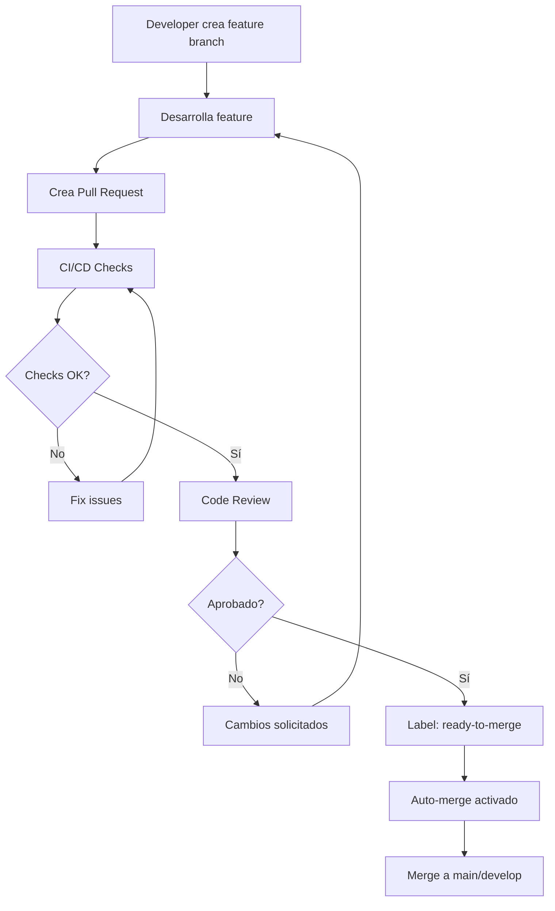

# Automerge de Features Managed

## 📋 Descripción

Automatiza la integración de ramas de features a la rama principal cuando se cumplen todos los criterios de calidad y aprobación, acelerando el flujo de desarrollo.

## 🎯 Casos de Uso

- Equipos que trabajan con múltiples features en paralelo
- Proyectos con ciclos de release frecuentes
- Desarrollo ágil con sprints cortos
- Integración continua con deployment automático

## 🔄 Flujo de Trabajo



## ⚙️ Configuración

### 1. Habilitar Auto-Merge en el Repositorio

**Settings > General > Pull Requests**:

- ☑ **Allow auto-merge**

### 2. Configurar Permisos de Actions

**Settings > Actions > General > Workflow permissions**:

1. Selecciona: **Read and write permissions**
2. Marca: **Allow GitHub Actions to create and approve pull requests**

### 3. Workflow de Auto-Merge

Crea `.github/workflows/feature-automerge.yml`:

```yaml
---
name: Feature Auto-Merge

on:
  pull_request:
    types: [labeled, unlabeled, synchronize, opened, edited, ready_for_review]
    branches:
      - main
      - develop

permissions:
  contents: write
  pull-requests: write
  checks: read

jobs:
  automerge:
    runs-on: ubuntu-latest
    if: |
      github.event.pull_request.draft == false &&
      contains(github.event.pull_request.labels.*.name, 'ready-to-merge')

    steps:
      - name: Checkout
        uses: actions/checkout@v4

      - name: Wait for CI checks
        uses: fountainhead/action-wait-for-check@v1.2.0
        with:
          token: ${{ secrets.GITHUB_TOKEN }}
          checkName: "CI Tests"
          ref: ${{ github.event.pull_request.head.sha }}
          timeoutSeconds: 600

      - name: Check approvals
        id: reviews
        uses: actions/github-script@v7
        with:
          script: |
            const { data: reviews } = await github.rest.pulls.listReviews({
              owner: context.repo.owner,
              repo: context.repo.repo,
              pull_number: context.issue.number
            });

            const approvals = reviews.filter(r => r.state === 'APPROVED').length;
            const requiredApprovals = 1;

            if (approvals >= requiredApprovals) {
              core.setOutput('approved', 'true');
            } else {
              core.setFailed(`Need ${requiredApprovals} approvals, got ${approvals}`);
            }

      - name: Enable auto-merge
        if: steps.reviews.outputs.approved == 'true'
        run: gh pr merge --auto --squash "$PR_NUMBER"
        env:
          PR_NUMBER: ${{ github.event.pull_request.number }}
          GITHUB_TOKEN: ${{ secrets.GITHUB_TOKEN }}
```

### 4. Workflow de CI/CD

Crea `.github/workflows/ci.yml`:

```yaml
---
name: CI Tests

on:
  pull_request:
    branches: [main, develop]

jobs:
  test:
    runs-on: ubuntu-latest

    steps:
      - uses: actions/checkout@v4

      - name: Setup Node.js
        uses: actions/setup-node@v4
        with:
          node-version: "20"
          cache: "npm"

      - name: Install dependencies
        run: npm ci

      - name: Run linter
        run: npm run lint

      - name: Run tests
        run: npm test

      - name: Build
        run: npm run build

      - name: Code coverage
        uses: codecov/codecov-action@v3
        with:
          files: ./coverage/coverage-final.json
```

### 5. Protección de Ramas

Configurar en **Settings → Branches**:

```
Branch name pattern: develop (o main)

☑ Require a pull request before merging
  ☑ Require approvals: 1
  ☐ Dismiss stale reviews (opcional)
  ☑ Require review from Code Owners (recomendado)

☑ Require status checks to pass before merging
  ☑ Require branches to be up to date before merging

  Status checks required:
  - test
  - lint
  - build

☑ Require conversation resolution before merging
☑ Allow auto-merge
☑ Automatically delete head branches
```

## 🏷️ Sistema de Labels

### Labels Obligatorios

Crea estos labels en tu repositorio:

| Label             | Color    | Descripción                                |
| ----------------- | -------- | ------------------------------------------ |
| `ready-to-merge`  | `0e8a16` | Indica que el PR está listo para automerge |
| `breaking-change` | `d73a4a` | Cambios que rompen compatibilidad          |
| `needs-review`    | `fbca04` | Requiere revisión adicional                |
| `do-not-merge`    | `b60205` | Bloquea el automerge                       |

### Crear Labels

```bash
gh label create "ready-to-merge" --color "0e8a16" --description "Ready for automerge"
gh label create "do-not-merge" --color "b60205" --description "Block automerge"
gh label create "breaking-change" --color "d73a4a" --description "Breaking changes"
```

### Automatizar Labels con Workflow

Crea `.github/workflows/auto-label.yml`:

```yaml
---
name: Auto Label

on:
  pull_request:
    types: [opened, edited]

jobs:
  label:
    runs-on: ubuntu-latest
    steps:
      - uses: actions/labeler@v5
        with:
          repo-token: ${{ secrets.GITHUB_TOKEN }}
```

Configuración en `.github/labeler.yml`:

```yaml
"ready-to-merge":
  - all:
      - changed-files:
          - all-globs-to-all-files: ["!**/*.md"]
      - base-branch: "main"

"documentation":
  - changed-files:
      - any-glob-to-any-file: "**/*.md"
```

## 🔐 Seguridad y Validaciones

### Pre-merge Checks

```yaml
# Añadir al workflow
- name: Security scan
  uses: aquasecurity/trivy-action@master
  with:
    scan-type: "fs"
    scan-ref: "."

- name: Check for secrets
  uses: trufflesecurity/trufflehog@main
  with:
    path: ./
```

### Condiciones Avanzadas

```yaml
# Solo automerge si:
if: |
  github.event.pull_request.draft == false &&
  contains(github.event.pull_request.labels.*.name, 'ready-to-merge') &&
  !contains(github.event.pull_request.labels.*.name, 'breaking-change') &&
  !contains(github.event.pull_request.labels.*.name, 'do-not-merge') &&
  github.event.pull_request.changed_files < 50
```

## 📊 Métricas y Monitoreo

### Dashboard de Merges

```yaml
- name: Log merge metrics
  run: |
    echo "PR_NUMBER=${{ github.event.pull_request.number }}" >> metrics.log
    echo "MERGED_AT=$(date -u +%Y-%m-%dT%H:%M:%SZ)" >> metrics.log
```

### Alertas

```yaml
- name: Alert on failed automerge
  if: failure()
  uses: rtCamp/action-slack-notify@v2
  env:
    SLACK_WEBHOOK: ${{ secrets.SLACK_WEBHOOK }}
    SLACK_TITLE: "Automerge Failed"
    SLACK_MESSAGE: "PR #${{ github.event.pull_request.number }} requires manual intervention"
```

## 🛠️ Troubleshooting

### El PR no se fusiona

**Verificaciones**:

```bash
# Comprobar status de checks
gh pr checks <PR_NUMBER>

# Ver estado del automerge
gh pr view <PR_NUMBER> --json autoMergeRequest

# Listar revisiones
gh api repos/:owner/:repo/pulls/<PR_NUMBER>/reviews
```

### Conflictos de Merge

Configure auto-update:

```yaml
- name: Update branch
  uses: actions/github-script@v7
  with:
    script: |
      await github.rest.pulls.updateBranch({
        owner: context.repo.owner,
        repo: context.repo.repo,
        pull_number: context.issue.number
      });
```

## 📝 Buenas Prácticas

1. **Naming Convention**: Usa prefijos en branches (`feature/`, `bugfix/`)
2. **Small PRs**: Limita el tamaño de los PRs (< 400 líneas)
3. **Descriptive Titles**: Usa conventional commits
4. **Required Reviewers**: Define CODEOWNERS para áreas críticas
5. **Rollback Strategy**: Tag releases para fácil rollback

### CODEOWNERS Example

```
# .github/CODEOWNERS
*.js    @frontend-team
*.py    @backend-team
/docs/  @tech-writers
*.yml   @devops-team
```

## 🔗 Recursos

- [GitHub Auto-merge Documentation](https://docs.github.com/en/pull-requests/collaborating-with-pull-requests/incorporating-changes-from-a-pull-request/automatically-merging-a-pull-request)
- [Branch Protection Rules](https://docs.github.com/en/repositories/configuring-branches-and-merges-in-your-repository/managing-protected-branches/about-protected-branches)
- [Implementación de ejemplo](../AutoMergeFeature/)

## ⚡ Implementación Rápida

```bash
# Copiar configuración del submódulo
cp AutoMergeFeature/.github/workflows/* .github/workflows/

# Crear labels
gh label create "ready-to-merge" --color "0e8a16"
gh label create "do-not-merge" --color "b60205"

# Push
git add .github/
git commit -m "Add feature automerge"
git push
```

---

**Nota**: Requiere configuración previa de protección de ramas y una suite de tests completa antes de habilitar el automerge.
