# Automerge de Hotfix con Cascada

## 📋 Descripción

Sistema de automerge para propagar automáticamente hotfixes críticos a través de múltiples ramas de release siguiendo el patrón Gitflow, asegurando que las correcciones lleguen a todas las versiones afectadas.

## 🎯 Casos de Uso

- Correcciones de seguridad críticas (CVEs)
- Bugs críticos en producción
- Parches que deben aplicarse a múltiples versiones
- Estrategia Gitflow con múltiples ramas de release

## 🔄 Flujo de Trabajo

```mermaid
graph TD
    A[Hotfix en release/1.0] -->|Merge PR manual| B[release/1.0]
    B -->|Auto-merge cascada| C[release/1.1]
    C -->|Auto-merge cascada| D[release/2.0]
    D -->|Auto-merge cascada| E[develop]
    
    F[Si conflicto en 1.1] -.->|Detiene cascada| G[PR manual 1.0 → 1.1]
    G -->|Resuelto| C
    
    style A fill:#ff6b6b
    style B fill:#4ecdc4
    style C fill:#4ecdc4
    style D fill:#4ecdc4
    style E fill:#95e1d3
    style F fill:#ffa502
    style G fill:#ffd93d
```



## ⚙️ Configuración

### 1. Preparación del Repositorio

Crea las ramas de release con versionado semántico:

```bash
# Desde tu repo local
cd tu-repositorio

# Asegúrate de estar en develop
git checkout develop
git pull origin develop

# Crear ramas release
git checkout -b release/1.0 develop
git push -u origin release/1.0

git checkout develop
git checkout -b release/1.1 develop
git push -u origin release/1.1

git checkout develop
git checkout -b release/2.0 develop
git push -u origin release/2.0

git checkout develop
```

### 2. Configurar Permisos en GitHub

**Settings > Actions > General > Workflow permissions**:

1. Selecciona: **Read and write permissions**
2. Marca: **Allow GitHub Actions to create and approve pull requests**

### 3. Desactivar Auto-Delete de Ramas

**Settings > General > Pull Requests**:

Desmarca: **Automatically delete head branches**

La action necesita que las ramas source permanezcan para completar los merges en cascada.

### 4. Crear Personal Access Token (PAT) - Opcional

**Solo si tienes protected branches**:

1. **Settings (tu perfil) > Developer settings > Personal access tokens > Tokens (classic)**
2. **Generate new token (classic)**
3. Scopes necesarios:
   - `repo` (Full control)
   - `workflow` (Update workflows)
4. Copia el token
5. **Tu repo > Settings > Secrets and variables > Actions > New repository secret**
6. Nombre: `MERGE_TOKEN`, Valor: tu PAT

### 5. Workflow de Cascada

Crea `.github/workflows/cascade-merge.yml`:

```yaml
---
name: 🔄 Hotfix Cascading Auto-Merge

on:
  pull_request:
    types:
      - closed

permissions:
  contents: write
  pull-requests: write
  issues: write

jobs:
  cascade-merge:
    name: Cascade Merge to Release Branches
    runs-on: ubuntu-latest

    # Solo ejecutar si:
    # 1. PR fue mergeado (no cerrado sin merge)
    # 2. Branch origen empieza con 'release/' o es un hotfix
    if: |
      github.event.pull_request.merged == true &&
      (startsWith(github.head_ref, 'release/') || startsWith(github.head_ref, 'hotfix/'))

    steps:
      - name: 📝 Info del PR
        run: |
          echo "PR #${{ github.event.pull_request.number }} mergeado"
          echo "Branch origen: ${{ github.head_ref }}"
          echo "Branch destino: ${{ github.base_ref }}"

      - name: 🚀 Cascading Auto-Merge
        uses: ActionsDesk/cascading-downstream-merge@v3.0.0
        with:
          github_token: ${{ secrets.GITHUB_TOKEN }}
          # Si tienes protected branches, usa:
          # merge_token: ${{ secrets.MERGE_TOKEN }}
          prefixes: release/
          ref_branch: develop  # Branch final de la cascada
```

### 6. Configurar Branch Protection

**Settings > Branches > Add branch protection rule**:

Para `develop` y `main`:
- Branch name pattern: `develop`
- ✅ Require pull request before merging
- ✅ Require status checks to pass (si tienes CI)

Para releases con protection, necesitas el PAT configurado para bypass.

## 🚀 Flujo Completo de Uso

### Paso 1: Crear Rama de Hotfix

```bash
# Crear rama de hotfix desde release/1.0
git checkout release/1.0
git pull origin release/1.0
git checkout -b hotfix/security-cve-2026

# Hacer el fix
echo "// FIXED: CVE-2026-12345" >> src/security.js
git add src/security.js
git commit -m "fix: Patch SQL injection vulnerability (CVE-2026-12345)"

# Push
git push -u origin hotfix/security-cve-2026
```

### Paso 2: Crear Pull Request

En GitHub Web:

1. **Pull requests > New pull request**
2. Base: `release/1.0` ← Compare: `hotfix/security-cve-2026`
3. Título: `[HOTFIX] Security patch CVE-2026-12345`
4. Descripción:

```markdown
## 🐛 Hotfix Crítico

### Problema
SQL injection en endpoint /api/users

### Solución
Sanitización de inputs con prepared statements

### Releases Afectadas
- [x] release/1.0
- [x] release/1.1 (auto-merge)
- [x] release/2.0 (auto-merge)
- [x] develop (auto-merge)
```

### Paso 3: Aprobar y Mergear

1. Reviewer aprueba el PR
2. **Merge pull request**
3. **Confirm merge**

### Paso 4: Observar la Cascada Automática

**Lo que sucede automáticamente**:


## 📊 Verificación de la Cascada

```bash
# Ver todos los PRs generados
gh pr list --state all --search "in:title cascade"

# Ver estado de un PR específico
gh pr view <PR_NUMBER>

# Ver el historial de una rama
git log --oneline --graph release/2.0
```

## 🔧 Manejo de Conflictos

### Cuando Ocurre un Conflicto

La cascada se **detiene automáticamente** en la rama con conflicto:

1. Recibirás una notificación del PR con conflictos
2. La action **NO** intentará mergear ramas posteriores
3. Debes resolver el conflicto manualmente

### Resolución Manual

```bash
# Checkout a la rama destino
git checkout release/1.1
git pull origin release/1.1

# Merge manual desde la rama anterior
git merge release/1.0

# Resolver conflictos
git status
# Edita los archivos con conflictos
git add .
git commit -m "Resolve merge conflicts from release/1.0"

# Push
git push origin release/1.1
```

Después del push, la cascada se **reanudará automáticamente** para las ramas siguientes.

## 🛠️ Troubleshooting

### La cascada no se inicia

**Verificar**:
1. Permisos de GitHub Actions configurados correctamente
2. El PR fue **merged** (no solo closed)
3. La rama origen coincide con el patrón `release/` o `hotfix/`

```bash
# Ver workflows ejecutados
gh run list --workflow="Hotfix Cascading Auto-Merge"

# Ver detalles de un run
gh run view <RUN_ID>
```

### PRs de cascada quedan abiertos

**Causas**:
- Branch protection bloqueando auto-merge
- Falta configurar PAT para bypass

**Solución**:
- Usa `merge_token: ${{ secrets.MERGE_TOKEN }}` en el workflow

### Cascada parcial

Si solo algunas ramas se mergearon:
1. Identifica dónde se detuvo
2. Verifica logs del workflow
3. Resuelve conflictos si existen
4. Re-ejecuta el workflow manualmente

## 📝 Buenas Prácticas

1. **Versionado Semántico**: Usa siempre `release/X.Y` format
2. **Tests Automáticos**: Ejecuta tests en cada release branch
3. **Hotfix Tags**: Crea tags después de cada hotfix
4. **Documentación**: Documenta los cambios en CHANGELOG.md
5. **Comunicación**: Notifica al equipo de hotfixes críticos

## 📈 Scripts de Ejemplo

### Script para Simular Hotfix Completo

```bash
#!/bin/bash
# simulate-hotfix.sh

REPO_NAME="gitflow-hotfix-demo"
mkdir -p $REPO_NAME && cd $REPO_NAME
git init

# Configuración
git config user.name "DevOps User"
git config user.email "devops@example.com"

# Setup inicial
echo "# Proyecto Demo" > README.md
git add README.md
git commit -m "Initial commit"

# Crear develop
git checkout -b develop
echo "v1.0.0" > version.txt
git add version.txt
git commit -m "Start develop branch"

# Crear releases
for version in 1.0 1.1 2.0; do
    git checkout develop
    git checkout -b release/$version
    echo "Release $version" > RELEASE-$version.md
    git add RELEASE-$version.md
    git commit -m "Release $version preparation"
done

# Simular HOTFIX en release/1.0
git checkout release/1.0
echo "HOTFIX: Critical security patch" >> CHANGELOG.md
git add CHANGELOG.md
git commit -m "hotfix: Fix CVE-2026-12345"

# CASCADA MANUAL (auto en GitHub)
for branch in release/1.1 release/2.0 develop; do
    git checkout $branch
    echo "Merging to $branch..."
    git merge release/1.0 -m "auto-merge: Propagate hotfix to $branch"
done

echo "✅ Cascada completada"
git log --oneline --all --graph
```

## 🔗 Recursos

- [Cascading Auto-Merge Action](https://github.com/ActionsDesk/cascading-downstream-merge)
- [Gitflow Workflow](https://www.atlassian.com/git/tutorials/comparing-workflows/gitflow-workflow)
- [Implementación de ejemplo](../AutoMergeHotfixCascada/)

## ⚡ Implementación Rápida

```bash
# Copiar workflow desde submódulo
cp AutoMergeHotfixCascada/.github/workflows/* .github/workflows/

# Configurar structure de ramas
./setup-release-branches.sh

# Commit y push
git add .github/
git commit -m "Add hotfix cascade automerge"
git push
```

---

**Nota**: Esta estrategia es ideal para equipos que mantienen múltiples versiones en producción y necesitan propagar fixes críticos de forma rápida y confiable.
