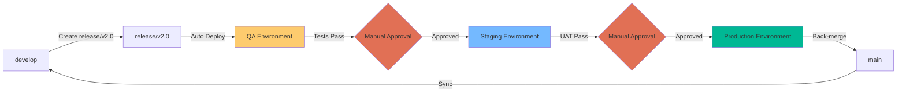

# Automerge de Release Multi-Entorno

## 📋 Descripción

Sistema de automerge para gestionar deployments automáticos a través de múltiples entornos (QA → Staging → Production) con approval gates manuales y validaciones automáticas.

## 🎯 Casos de Uso

- Deployments progresivos a través de entornos
- Validación automatizada en cada ambiente
- Control de releases con approval gates
- CI/CD con múltiples stages

## 🔄 Flujo de Trabajo



## ⚙️ Configuración

### 1. Configurar Environments en GitHub

**Settings > Environments**:

#### Environment: QA

1. Click **New environment**
2. Name: `qa`
3. **Configure environment**:
   - ☐ Required reviewers (ninguno, auto-deploy)
   - ☐ Wait timer: 0 minutes
   - Deployment branches: `Selected branches` → `release/*`
4. **Environment secrets**:
   - `QA_API_URL`: `https://api-qa.tuapp.com`
   - `QA_DB_HOST`: `qa-db.internal`
5. **Environment variables**:
   - `ENV_NAME`: `qa`
   - `LOG_LEVEL`: `debug`

#### Environment: Staging

1. Click **New environment**
2. Name: `staging`
3. **Configure environment**:
   - ☑ **Required reviewers**: Agregar 1-2 reviewers
   - ☑ **Prevent administrators from bypassing**: ON
   - Deployment branches: `Selected branches` → `release/*`
4. **Environment secrets**:
   - `STAGING_API_URL`: `https://api-staging.tuapp.com`
5. **Environment variables**:
   - `ENV_NAME`: `staging`
   - `LOG_LEVEL`: `info`

#### Environment: Production

1. Click **New environment**
2. Name: `production`
3. **Configure environment**:
   - ☑ **Required reviewers**: Agregar 2+ reviewers (senior team)
   - ☑ **Prevent administrators from bypassing**: ON
   - ☑ **Wait timer**: 5 minutes (cooldown antes de aprobar)
   - Deployment branches: `Only protected branches` (main)
4. **Environment secrets**:
   - `PROD_API_URL`: `https://api.tuapp.com`
5. **Environment variables**:
   - `ENV_NAME`: `production`
   - `LOG_LEVEL`: `warn`

### 2. Configurar Branch Protection

**Settings > Branches > Add rule**:

#### Para `main`:
```
Branch name pattern: main

☑ Require a pull request before merging
  ☑ Require approvals: 2
☑ Require status checks to pass
  - build
  - test
☑ Require branches to be up to date
☑ Do not allow bypassing
```

#### Para `release/*`:
```
Branch name pattern: release/*

☑ Require a pull request before merging
  ☑ Require approvals: 1
☑ Require status checks to pass
  - qa-tests
```

### 3. Workflow Multi-Entorno

Crea `.github/workflows/release-pipeline.yml`:

```yaml
---
name: 🚀 Release Multi-Environment Pipeline

on:
  push:
    branches:
      - 'release/**'
  
  workflow_dispatch:
    inputs:
      environment:
        description: 'Target environment'
        required: true
        type: choice
        options:
          - qa
          - staging
          - production
      release_branch:
        description: 'Release branch (e.g., release/v2.0)'
        required: true
        type: string

concurrency:
  group: release-${{ github.ref_name }}-${{ inputs.environment || 'qa' }}
  cancel-in-progress: false

env:
  NODE_VERSION: '20'
  RELEASE_VERSION: ${{ github.ref_name }}

jobs:
  # ============================================
  # JOB 1: BUILD
  # ============================================
  build:
    name: 🏗️ Build Release Artifacts
    runs-on: ubuntu-latest
    
    steps:
      - name: 📥 Checkout release branch
        uses: actions/checkout@v4
        with:
          ref: ${{ inputs.release_branch || github.ref }}

      - name: 🔧 Setup Node.js
        uses: actions/setup-node@v4
        with:
          node-version: ${{ env.NODE_VERSION }}
          cache: 'npm'

      - name: 📦 Install dependencies
        run: npm ci

      - name: 🧪 Run linter
        run: npm run lint

      - name: 🧪 Run unit tests
        run: npm test -- --coverage

      - name: 🏗️ Build application
        run: npm run build
        env:
          CI: true

      - name: 📊 Generate version info
        run: |
          echo "VERSION=${GITHUB_REF_NAME}" >> version.txt
          echo "COMMIT=${GITHUB_SHA::7}" >> version.txt
          echo "BUILD_DATE=$(date -u +%Y-%m-%dT%H:%M:%SZ)" >> version.txt
          cp version.txt dist/

      - name: 📤 Upload build artifacts
        uses: actions/upload-artifact@v4
        with:
          name: release-build-${{ github.sha }}
          path: |
            dist/
            package.json
          retention-days: 30

  # ============================================
  # JOB 2: DEPLOY TO QA (Automatic)
  # ============================================
  deploy-qa:
    name: 🧪 Deploy to QA
    needs: build
    runs-on: ubuntu-latest
    environment: qa
    
    steps:
      - name: 📥 Download artifacts
        uses: actions/download-artifact@v4
        with:
          name: release-build-${{ github.sha }}
          path: ./dist

      - name: 🚀 Deploy to QA
        run: |
          echo "Deploying to QA environment..."
          echo "API_URL: ${{ vars.QA_API_URL }}"
          # Aquí tu lógica de deploy (AWS, Azure, etc.)

      - name: 🧪 Run QA Tests
        run: |
          echo "Running QA integration tests..."
          # npm run test:integration

      - name: 📊 QA Health Check
        run: |
          echo "Checking QA health..."
          curl -f ${{ vars.QA_API_URL }}/health || exit 1

  # ============================================
  # JOB 3: DEPLOY TO STAGING (Manual Approval)
  # ============================================
  deploy-staging:
    name: 🎭 Deploy to Staging
    needs: deploy-qa
    runs-on: ubuntu-latest
    environment: staging
    
    steps:
      - name: 📥 Download artifacts
        uses: actions/download-artifact@v4
        with:
          name: release-build-${{ github.sha }}
          path: ./dist

      - name: 🚀 Deploy to Staging
        run: |
          echo "Deploying to Staging environment..."
          echo "API_URL: ${{ vars.STAGING_API_URL }}"

      - name: 🧪 Run UAT Tests
        run: |
          echo "Running UAT tests..."

      - name: 📊 Staging Health Check
        run: |
          curl -f ${{ vars.STAGING_API_URL }}/health || exit 1

  # ============================================
  # JOB 4: MERGE TO MAIN
  # ============================================
  merge-to-main:
    name: 🔀 Merge to Main
    needs: deploy-staging
    runs-on: ubuntu-latest
    permissions:
      contents: write
      pull-requests: write
    
    steps:
      - name: 📥 Checkout
        uses: actions/checkout@v4
        with:
          fetch-depth: 0

      - name: 🏷️ Create Release Tag
        run: |
          git config user.name "GitHub Actions"
          git config user.email "actions@github.com"
          VERSION=${GITHUB_REF_NAME#release/}
          git tag -a "$VERSION" -m "Release $VERSION"
          git push origin "$VERSION"

      - name: 📝 Create PR to Main
        env:
          GITHUB_TOKEN: ${{ secrets.GITHUB_TOKEN }}
        run: |
          gh pr create \
            --base main \
            --head ${{ github.ref_name }} \
            --title "Release: ${{ github.ref_name }}" \
            --body "Auto-generated PR for production release" \
            --label "release"

      - name: 🤖 Enable Auto-Merge
        env:
          GITHUB_TOKEN: ${{ secrets.GITHUB_TOKEN }}
        run: |
          PR_NUMBER=$(gh pr list --head ${{ github.ref_name }} --json number --jq '.[0].number')
          gh pr merge $PR_NUMBER --auto --squash

  # ============================================
  # JOB 5: DEPLOY TO PRODUCTION
  # ============================================
  deploy-production:
    name: 🚀 Deploy to Production
    needs: merge-to-main
    runs-on: ubuntu-latest
    environment: production
    
    steps:
      - name: 📥 Download artifacts
        uses: actions/download-artifact@v4
        with:
          name: release-build-${{ github.sha }}
          path: ./dist

      - name: 🚀 Deploy to Production
        run: |
          echo "Deploying to Production..."
          echo "API_URL: ${{ vars.PROD_API_URL }}"

      - name: 📊 Production Health Check
        run: |
          curl -f ${{ vars.PROD_API_URL }}/health || exit 1

      - name: 📢 Notify Success
        if: success()
        run: |
          echo "✅ Production deployment successful!"

  # ============================================
  # JOB 6: BACK-MERGE TO DEVELOP
  # ============================================
  back-merge:
    name: 🔄 Back-merge to Develop
    needs: deploy-production
    runs-on: ubuntu-latest
    permissions:
      contents: write
    
    steps:
      - name: 📥 Checkout
        uses: actions/checkout@v4
        with:
          ref: main
          fetch-depth: 0

      - name: 🔀 Merge main to develop
        run: |
          git config user.name "GitHub Actions"
          git config user.email "actions@github.com"
          git checkout develop
          git merge main --no-ff -m "Back-merge main to develop after production release"
          git push origin develop
```

## 📊 Monitoreo y Validación

### Ver Estado de Deployments

```bash
# Ver deployments recientes
gh api repos/:owner/:repo/deployments

# Ver estado de un environment
gh api repos/:owner/:repo/environments/production

# Ver workflow runs
gh run list --workflow="Release Multi-Environment Pipeline"
```

### Dashboard de Releases

Crea un workflow para generar dashboard:

```yaml
- name: Generate Release Dashboard
  run: |
    echo "## Release Status" > dashboard.md
    echo "- QA: ✅ Deployed" >> dashboard.md
    echo "- Staging: ⏳ Pending Approval" >> dashboard.md
    echo "- Production: ❌ Not Deployed" >> dashboard.md
```

## 🛠️ Troubleshooting

### Deployment Falla en QA

```bash
# Ver logs del workflow
gh run view --log

# Re-ejecutar solo el job QA
gh run rerun <RUN_ID> --job=deploy-qa
```

### Approval Bloqueado

Si un reviewer no está disponible:
1. Configura reviewers alternativos en environment settings
2. O temporalmente ajusta required reviewers a 1

### Rollback de Production

```bash
# Revertir a versión anterior
git revert <COMMIT_HASH>
git push origin main

# O hacer rollback del deployment
# (depende de tu plataforma: AWS, Azure, etc.)
```

## 📝 Buenas Prácticas

1. **Smoke Tests**: Ejecuta smoke tests en cada environment
2. **Feature Flags**: Usa feature flags para releases gradual
3. **Monitoring**: Configura alertas post-deployment
4. **Rollback Plan**: Ten un plan de rollback documentado
5. **Release Notes**: Genera release notes automáticamente

## 🔗 Recursos

- [GitHub Environments](https://docs.github.com/en/actions/deployment/targeting-different-environments/using-environments-for-deployment)
- [AWS Prescriptive Guidance](https://docs.aws.amazon.com/prescriptive-guidance/latest/patterns/implement-a-gitflow-branching-strategy-for-multi-account-devops-environments.html)
- [Implementación de ejemplo](../AutoMergeReleaseMultiEntorno/)

## ⚡ Implementación Rápida

```bash
# Copiar workflow
cp AutoMergeReleaseMultiEntorno/.github/workflows/* .github/workflows/

# Configurar environments (manual en GitHub UI)
# Configurar branch protection (manual en GitHub UI)

# Push
git add .github/
git commit -m "Add multi-environment release pipeline"
git push
```

---

**Nota**: Esta estrategia requiere una planificación cuidadosa de environments y approval gates. Es ideal para aplicaciones críticas que requieren validación en múltiples stages antes de producción.
