# Trunk-Based Development con Ramas de Corta Duración

## 📋 Descripción

Estrategia de desarrollo con un trunk único (main) siempre deployable, donde las ramas de features viven máximo 2 días y se integran automáticamente mediante CI/CD robusto y minimal approval overhead.

## 🎯 Casos de Uso

- Equipos que practican Continuous Integration/Deployment
- Startups y equipos ágiles con ciclos rápidos
- Microservicios con deploys frecuentes
- Proyectos que requieren alta velocidad de desarrollo

## 🔄 Flujo de Trabajo

```mermaid
graph LR
    A[main trunk] --> B[feature/quick-fix]
    B -->|Max 2 días| C[PR + CI]
    C -->|Auto-merge| D[main]
    D -->|Auto-deploy| E[Staging]
    E -->|Manual gate| F[Production]
    
    G[feature/api-v2] -->|Max 2 días| C
    H[fix/bug-123] -->|Max 1 día| C
    
    style A fill:#2d3436
    style B fill:#00b894
    style D fill:#2d3436
    style E fill:#74b9ff
    style F fill:#fd79a8
```



## ⚙️ Configuración

### 1. Configurar Branch Protection para Main

**Settings > Branches > Add rule**:

```
Branch name pattern: main

☑ Require a pull request before merging
  ☐ Require approvals: 0 (o 1 para equipos junior)
  ☐ Dismiss stale approvals (desactivado)

☑ Require status checks to pass before merging
  ☑ Require branches to be up to date before merging
  
  Status checks required:
  - lint
  - test
  - build
  - integration-test
  - coverage-check

☑ Require conversation resolution before merging
☑ Require linear history (recomendado para trunk-based)
☑ Allow auto-merge
☑ Automatically delete head branches

☐ Allow force pushes: Nobody
☐ Allow deletions: Nobody
```

**Clave**: No requieres approvals (o solo 1), pero CI debe ser estricto.

### 2. Workflow CI/CD

Crea `.github/workflows/trunk-ci.yml`:

```yaml
---
name: 🚀 Trunk-Based CI/CD

on:
  pull_request:
    branches:
      - main
  push:
    branches:
      - main

# Cancela runs previos del mismo PR
concurrency:
  group: ${{ github.workflow }}-${{ github.ref }}
  cancel-in-progress: true

env:
  NODE_VERSION: '20'

jobs:
  # ============================================
  # FAST FEEDBACK: Lint (< 30s)
  # ============================================
  lint:
    name: 🔍 Lint
    runs-on: ubuntu-latest
    timeout-minutes: 5
    
    steps:
      - name: 📥 Checkout
        uses: actions/checkout@v4
        with:
          fetch-depth: 0

      - name: 🔧 Setup Node.js
        uses: actions/setup-node@v4
        with:
          node-version: ${{ env.NODE_VERSION }}
          cache: 'npm'

      - name: 📦 Install dependencies
        run: npm ci --prefer-offline

      - name: 🔍 Run ESLint
        run: npm run lint

      - name: 🎨 Check formatting (Prettier)
        run: npm run format:check

  # ============================================
  # CORE: Tests (< 2min)
  # ============================================
  test:
    name: 🧪 Test
    runs-on: ubuntu-latest
    timeout-minutes: 10
    
    steps:
      - name: 📥 Checkout
        uses: actions/checkout@v4

      - name: 🔧 Setup Node.js
        uses: actions/setup-node@v4
        with:
          node-version: ${{ env.NODE_VERSION }}
          cache: 'npm'

      - name: 📦 Install dependencies
        run: npm ci --prefer-offline

      - name: 🧪 Run unit tests
        run: npm test -- --coverage --maxWorkers=2

      - name: 📊 Coverage check (80% threshold)
        run: |
          COVERAGE=$(cat coverage/coverage-summary.json | jq '.total.lines.pct')
          echo "Coverage: $COVERAGE%"
          if (( $(echo "$COVERAGE < 80" | bc -l) )); then
            echo "❌ Coverage below 80%"
            exit 1
          fi

      - name: 📤 Upload coverage
        uses: codecov/codecov-action@v4
        if: always()
        with:
          files: ./coverage/coverage-final.json

  # ============================================
  # BUILD: Application (< 1min)
  # ============================================
  build:
    name: 🏗️ Build
    runs-on: ubuntu-latest
    timeout-minutes: 5
    
    steps:
      - name: 📥 Checkout
        uses: actions/checkout@v4

      - name: 🔧 Setup Node.js
        uses: actions/setup-node@v4
        with:
          node-version: ${{ env.NODE_VERSION }}
          cache: 'npm'

      - name: 📦 Install dependencies
        run: npm ci --prefer-offline

      - name: 🏗️ Build application
        run: npm run build
        env:
          CI: true

      - name: 📦 Check bundle size
        run: |
          BUNDLE_SIZE=$(du -sb dist | cut -f1)
          MAX_SIZE=5242880  # 5MB
          if [ $BUNDLE_SIZE -gt $MAX_SIZE ]; then
            echo "❌ Bundle too large: $(($BUNDLE_SIZE / 1024))KB > 5MB"
            exit 1
          fi

      - name: 📤 Upload build artifacts
        uses: actions/upload-artifact@v4
        with:
          name: build-${{ github.sha }}
          path: dist/
          retention-days: 7

  # ============================================
  # INTEGRATION: E2E Tests (< 5min)
  # ============================================
  integration-test:
    name: 🔗 Integration Tests
    runs-on: ubuntu-latest
    needs: build
    timeout-minutes: 10
    
    steps:
      - name: 📥 Checkout
        uses: actions/checkout@v4

      - name: 📥 Download build
        uses: actions/download-artifact@v4
        with:
          name: build-${{ github.sha }}
          path: dist/

      - name: 🔧 Setup Node.js
        uses: actions/setup-node@v4
        with:
          node-version: ${{ env.NODE_VERSION }}

      - name: 📦 Install dependencies
        run: npm ci

      - name: 🧪 Run integration tests
        run: npm run test:integration

  # ============================================
  # AUTO-MERGE: Enable for PRs
  # ============================================
  auto-merge:
    name: 🤖 Auto-Merge
    runs-on: ubuntu-latest
    needs: [lint, test, build, integration-test]
    if: github.event_name == 'pull_request'
    permissions:
      contents: write
      pull-requests: write
    
    steps:
      - name: ✅ Auto-approve
        if: github.actor != 'dependabot[bot]'
        run: gh pr review --approve "$PR_URL"
        env:
          PR_URL: ${{ github.event.pull_request.html_url }}
          GITHUB_TOKEN: ${{ secrets.GITHUB_TOKEN }}

      - name: 🔀 Enable auto-merge
        run: gh pr merge --auto --squash "$PR_URL"
        env:
          PR_URL: ${{ github.event.pull_request.html_url }}
          GITHUB_TOKEN: ${{ secrets.GITHUB_TOKEN }}

  # ============================================
  # DEPLOY: Auto-deploy to Staging
  # ============================================
  deploy-staging:
    name: 🚀 Deploy to Staging
    runs-on: ubuntu-latest
    needs: [lint, test, build, integration-test]
    if: github.ref == 'refs/heads/main' && github.event_name == 'push'
    environment: staging
    
    steps:
      - name: 📥 Download build
        uses: actions/download-artifact@v4
        with:
          name: build-${{ github.sha }}
          path: dist/

      - name: 🚀 Deploy to staging
        run: |
          echo "Deploying to staging..."
          # Tu lógica de deploy aquí

      - name: 📊 Health check
        run: |
          curl -f https://staging.tuapp.com/health || exit 1
```

### 3. Workflow de Auto-Merge Rápido

Crea `.github/workflows/fast-automerge.yml`:

```yaml
---
name: ⚡ Fast Auto-Merge

on:
  pull_request:
    types: [opened, reopened, ready_for_review]
    branches:
      - main

permissions:
  contents: write
  pull-requests: write

jobs:
  enable-automerge:
    name: Enable Auto-Merge
    runs-on: ubuntu-latest
    if: |
      github.event.pull_request.draft == false &&
      startsWith(github.head_ref, 'feature/') ||
      startsWith(github.head_ref, 'fix/')
    
    steps:
      - name: 📝 Check branch age
        id: check-age
        uses: actions/github-script@v7
        with:
          script: |
            const branch = context.payload.pull_request.head.ref;
            const { data: branchData } = await github.rest.repos.getBranch({
              owner: context.repo.owner,
              repo: context.repo.repo,
              branch: branch
            });
            
            const createdAt = new Date(branchData.commit.commit.author.date);
            const now = new Date();
            const ageInDays = (now - createdAt) / (1000 * 60 * 60 * 24);
            
            if (ageInDays > 2) {
              core.setFailed(`Branch is ${ageInDays.toFixed(1)} days old (max 2 days)`);
            }

      - name: 🤖 Enable auto-merge
        run: gh pr merge --auto --squash "$PR_NUMBER"
        env:
          PR_NUMBER: ${{ github.event.pull_request.number }}
          GITHUB_TOKEN: ${{ secrets.GITHUB_TOKEN }}
```

## 📏 Políticas de Ramas

### Naming Conventions

```
feature/<ticket-id>-short-description
fix/<ticket-id>-bug-description
hotfix/<critical-issue>
```

Ejemplos:
- `feature/JIRA-123-user-auth`
- `fix/BUG-456-memory-leak`
- `hotfix/critical-security-patch`

### Reglas de Lifetime

| Tipo de Rama | Lifetime Máximo | Auto-Delete |
|--------------|----------------|-------------|
| feature/* | 2 días | ✅ Sí |
| fix/* | 1 día | ✅ Sí |
| hotfix/* | 4 horas | ✅ Sí |

### Script para Alertar Ramas Viejas

Crea `.github/workflows/stale-branches.yml`:

```yaml
---
name: 🧹 Alert Stale Branches

on:
  schedule:
    - cron: '0 9 * * *'  # Daily at 9 AM
  workflow_dispatch:

jobs:
  check-stale:
    name: Check for Stale Branches
    runs-on: ubuntu-latest
    
    steps:
      - uses: actions/checkout@v4
        with:
          fetch-depth: 0

      - name: Find stale branches
        run: |
          echo "🔍 Checking for branches older than 2 days..."
          
          CUTOFF_DATE=$(date -d '2 days ago' +%s)
          
          git for-each-ref --format='%(refname:short) %(committerdate:unix)' refs/remotes/origin/ | \
          while read branch timestamp; do
            if [ "$timestamp" -lt "$CUTOFF_DATE" ] && [[ "$branch" == *"feature/"* ]]; then
              echo "⚠️  Stale branch: $branch"
              # Opcionalmente notificar al owner
            fi
          done
```

## 🎯 Feature Flags

Para trabajo en progreso, usa feature flags en lugar de ramas long-lived:

```javascript
// config/features.js
export const FEATURES = {
  NEW_DASHBOARD: process.env.FEATURE_NEW_DASHBOARD === 'true',
  BETA_API: process.env.FEATURE_BETA_API === 'true',
};

// uso en código
if (FEATURES.NEW_DASHBOARD) {
  return <NewDashboard />;
}
return <OldDashboard />;
```

## 📊 Métricas

### Métricas Clave

- **Lead Time**: Tiempo desde commit hasta producción
- **Deployment Frequency**: Cuántos deploys por día
- **MTTR**: Mean Time To Recovery
- **Change Failure Rate**: % de deploys que causan issues

### Dashboard

```yaml
- name: Track Metrics
  run: |
    echo "COMMIT_TIME=$(git log -1 --format=%ct)" >> metrics.log
    echo "DEPLOY_TIME=$(date +%s)" >> metrics.log
    LEAD_TIME=$((DEPLOY_TIME - COMMIT_TIME))
    echo "Lead time: ${LEAD_TIME}s"
```

## 🛠️ Troubleshooting

### Branch Bloqueada por Checks Lentos

**Optimizar CI**:
1. Paralelizar tests
2. Usar cache para dependencies
3. Limitar timeout de jobs
4. Ejecutar solo tests afectados

### Conflictos Frecuentes

**Soluciones**:
1. Rebase frecuente con main
2. Reducir tamaño de PRs
3. Comunicación de equipo en cambios grandes

### Rollback Rápido

```bash
# Revert último commit en main
git revert HEAD
git push origin main

# O deploy versión anterior
git checkout <PREVIOUS_TAG>
# Deploy
```

## 📝 Buenas Prácticas

1. **Small PRs**: Máximo 200 líneas de código
2. **Rebase Daily**: Sincroniza con main al menos 1 vez al día
3. **Fast CI**: CI debe completar en < 5 minutos
4. **Feature Flags**: Para features grandes
5. **Pair Programming**: Reduce need for reviews

## 🔗 Recursos

- [Trunk Based Development](https://trunkbaseddevelopment.com/)
- [A successful Git branching model](https://nvie.com/posts/a-successful-git-branching-model/)
- [Implementación de ejemplo](../AutoMergeTrunkBasedShortLivedBranches/)

## ⚡ Implementación Rápida

```bash
# Copiar workflows
cp AutoMergeTrunkBasedShortLivedBranches/.github/workflows/* .github/workflows/

# Configurar branch protection (manual en GitHub)

# Push
git add .github/
git commit -m "Add trunk-based development workflows"
git push
```

---

**Nota**: Esta estrategia requiere disciplina del equipo, CI robusto y cultura de confianza. Es ideal para equipos maduros que buscan maximizar velocidad de entrega.
